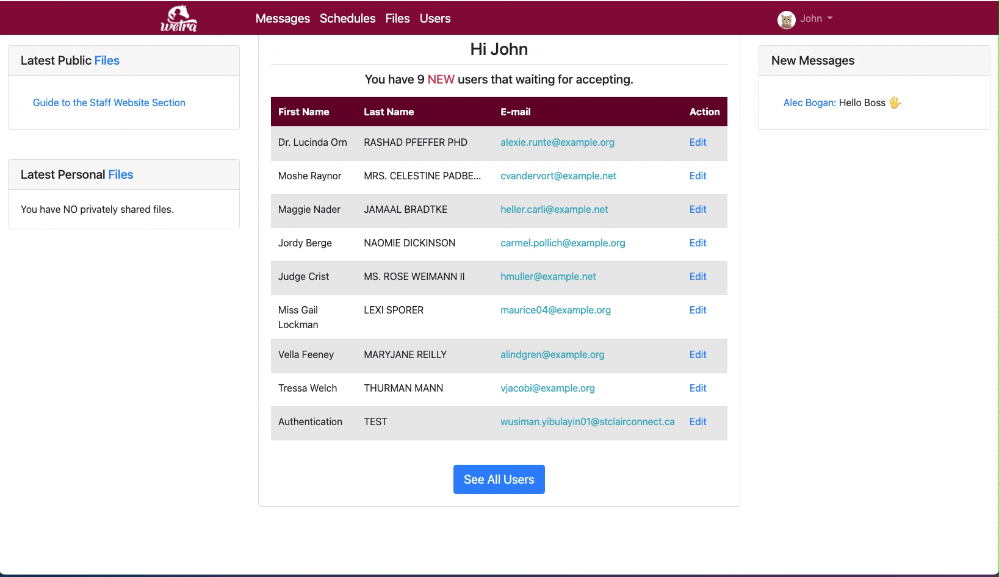
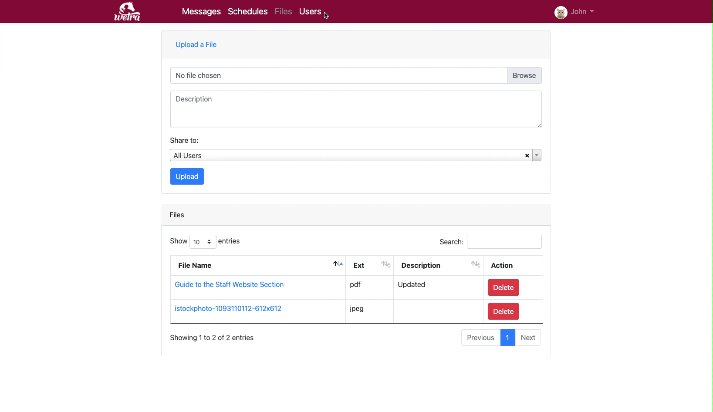
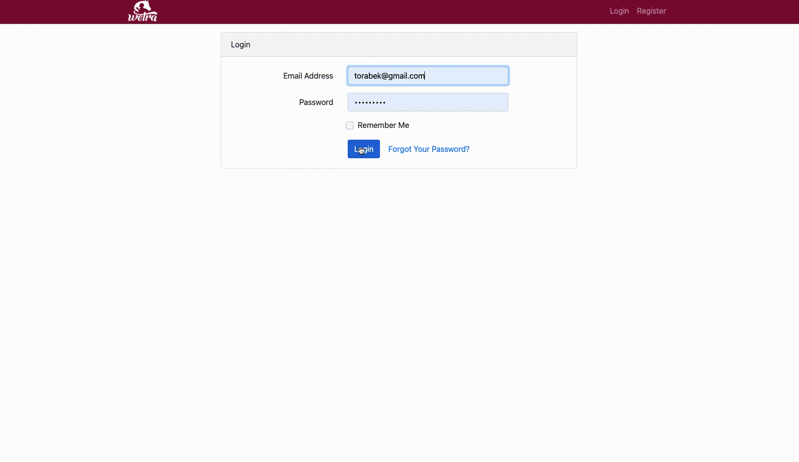

# WETRA Content Management System

## Project Developers:
#### Wusiman Yibulayin (Ibrahim Osman) (Web App)
#### Elena Polyakova (Web App)
#### Christopher Corbett (Mobile App)
#### Nigam Patel (Mobile App)

## Table of contents
* [Description](#description)
* [Built With](#built-with)
* [Demos](#demos)
* [Credits](#credits)
* [License](#license)

## Description
The Windsor-Essex Therapeutic Riding Association or WETRA want us to build a web based Content Management System (CMS) to allow for communication between staff along with the ability to retrieve policies, view their schedules, and request time off.

## Built With

- Laravel
- PHP
- HTML
- CSS
- Bootstrap
- JavaScript
- jQuery
- Ajax

## Demos

### Admin's home page
Admins can see Latest files, Newly registered users and New messages in their home page.

### Message page
Admin users and non-admin users have same messages page. They can send group messages or personal messages in this page.

### Schedule page
Even if admin users and non-admin users have the same page, their roles are different
- Admin: can view all events and tasks on the calendar. Can add, edit and delete events and tasks. Can accept or reject 
time-off requested tasks.
- Non-admin: only can view events, public or assigned tasks. Can request time-off a task. Can mark as complete of a task.

### Admin' Users Page
Admin can view, edit and delete any users. Can allow or forbid any user to use the system.

### Non-admin Users' Pages
The following gif animation demonstrating all pages the non-admin user can browse

### [All screen recorded gifs](Gif)

## Credits

- [Laravel](https://github.com/laravel/framework) The MIT license.
- [Bootstrap](https://getbootstrap.com/docs/4.0/about/license/) The MIT license. 
- [Pusher](https://github.com/pusher/pusher-http-php) Channels HTTP PHP Library. The MIT license. 
- [Sweet Alert](https://github.com/realrashid/sweet-alert). The MIT license. 
- [Sweetalert2](https://github.com/sweetalert2/sweetalert2) The MIT license. 
- [Yajra Data Tables](https://github.com/yajra/laravel-datatables) API for Laravel 4|5|6|7|8|9. The MIT license.
- [Full Calendar](https://github.com/fullcalendar/fullcalendar) The MIT license. 
- [Emoji-Button](https://github.com/joeattardi/picmo/packages/55603?version=4.0.0) The MIT license. 
- [Google icons](https://fonts.google.com/icons) Apache License 2.0. 
- [jQuery](https://jquery.org/license/) The MIT license. 
